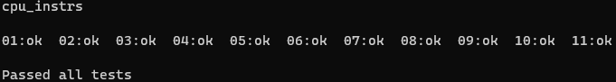
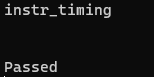
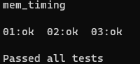
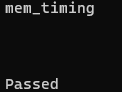

[](https://ci.appveyor.com/project/MatthewMer/gameboyx)

## GBX (Game Boy Color Emulator Extended) ##

This is a Gameboy (Color) emulator utilising [ImGui](https://github.com/ocornut/imgui) with [SDL2](https://github.com/libsdl-org/SDL/releases/tag/release-2.28.2) and [Vulkan](https://vulkan.lunarg.com/) graphics API.

### How do I get set up? ###

### Precompiled: ###
* download the precompiled binaries from the releases section

alternatively you can build the application from source as described in the following sections

### Build from source: ###

* install latest [Vulkan SDK](https://vulkan.lunarg.com/) (Requires a GPU with at least Vulkan 1.0 support)
* clone repository with following command (to clone the required submodules):
```
git clone --recurse-submodules https://github.com/MatthewMer/gameboyx.git --recursive
```
* in the cloned repository open gameboyx.sln with Visual Studio 2022
* you can either build an installer or create a portable executable, as described in the following section

### Portable: ###
* set configuration to `Release_portable` , set your target platform and start compilation
* required files in `./x64/Release/` or `./Win32/Release/` are `gameboyx.exe` , `SDL2.dll` and the folders `control` , `icon` , `font` and `boot` , the application will automatically create the remaining folder hierarchy on execution

### Installer: ###
#### Option 1: ####
* go to `Tools -> Options` , navigate in the dialog to `Projects and Solutions -> Build and Run` and uncheck `Only build startup projects and dependencies on Run`
* set configuration to `Release_installer` , set your target platform and start compilation

#### Option 2: ####
* set configuration to `Release_installer` and set your target platform
* in the Solution Explorer right-click on `gameboyx_win_x64` or `gameboyx_win_x86` (depending on your target platform) and click on `Build`

(the resulting installer executable and msi package are found in `./gameboyx_win_x64/Release` or `./gameboyx_win_x86/Release` , depending on the selected platform)

Note: in the installer version folders for roms, configs, etc. are located in `%APPDATA%/<username>/GameboyX/`

### Feature state ###

- [x] Emulation at ~95%, many games are playable

- [x] 7.1 Surround sound and sampling rate up to 96kHz with reverb

- [x] Instruction debugger
      
- [x] Register state observer

- [x] Hardware state observer

- [x] Memory observer
      
- [ ] Graphics debugger

- [ ] Audio debugger

- [ ] Audio effects

- [ ] Custom shaders (GLSL for Vulkan)

- [x] Controller support

- [ ] Call stack (sort of)

- [ ] Networking capabilites

### Control/Shortcuts ###

#### Game control ####

| Keybinds | Description |
| --- | --- |
| `Up` `Down` `Left` `Right`  | Up, Down, Left, Right |
| `F` | A |
| `D` | B |
| `G` | Start |
| `R` | Select |

#### General ####

| Keybinds | Description |
| --- | --- |
| `Return` | start selected game |
| `Up` `Down` | navigate games |
| `Esc` | end game |
| `Delete` | delete selected games |
| `Shift` + `left mouse` | multiselect (like Windows explorer) |
| `Ctrl` + `left mouse` | (un)select single games |
| `F1` | reset game |
| `F3` | next instruction (debugger) |
| `F9` | auto run instructions (debugger) |
| `F10` | toggle menu bar |
| `F11` | toggle fullscreen |
| `Shift` + `mouse scroll` | scroll entire page (debugger/memory inspector) |

### Tested Games (Currently only ROM, MBC1 and MBC3 mapper for DMG) ###

* Pokemon Red (MBC3)

* Pokemon Silver / Crystal (MBC3)

* Zelda - Link's Awakening (MBC1)

* Tetris (ROM)

* Super Mario Bros. Deluxe (MBC5)

### Blargg's Test Roms ###

* Instruction Test



* Instruction Timing (Currently fails as soon as PPU is is taken into account during timer processing)



* Mem Timing



* Mem Timing 2



### Ressources ###

* [Pan Docs](https://gbdev.io/pandocs/About.html)
* [GB Dev Guide](https://github.com/Hacktix/GBEDG/tree/master) (more accurate)
* [Opcode Table](https://www.pastraiser.com/cpu/gameboy/gameboy_opcodes.html)
* [docs](./docs/)

### Who do I talk to? ###

* Repo owner
