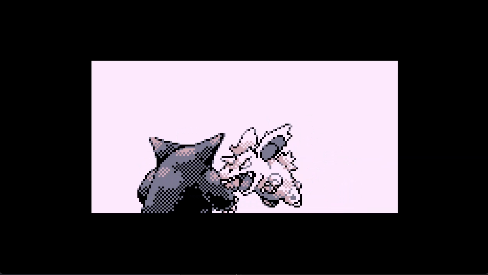

## GBX (Game Boy Color Emulator Extended) ##

This is a Gameboy (Color) emulator utilising [ImGui](https://github.com/ocornut/imgui) with [SDL2](https://github.com/libsdl-org/SDL/releases/tag/release-2.28.2) and [Vulkan](https://vulkan.lunarg.com/) graphics API.

### How do I get set up? ###
* install latest [Vulkan SDK](https://vulkan.lunarg.com/)
* clone repository with following command (to clone the required submodules):
```
git clone --recurse-submodules https://github.com/MatthewMer/gameboyx.git
```
* compile with Visual Studio 2022 (open ./gameboyx.sln, set to Release and your target platform and start the build process)

### Demo ###

[](https://www.youtube.com/watch?v=FxrE-5kgZR0 "Gameboy Emulator Demo")

### Tested Games (Currently only ROM and MBC3 (probably MBC1 mapper but not tested) for DMG) ###

* Pokemon Red

* Tetris

### Blargg's Test Roms ###

* Instruction Test


* Instruction Timing


* Mem Timing


* Mem Timing 2


### Ressources ###

* [Pan Docs](https://gbdev.io/pandocs/About.html)
* [GB Dev Guide](https://github.com/Hacktix/GBEDG/tree/master) (more accurate)
* [Opcode Table](https://www.pastraiser.com/cpu/gameboy/gameboy_opcodes.html)
* [docs](./docs/)

### Who do I talk to? ###

* Repo owner